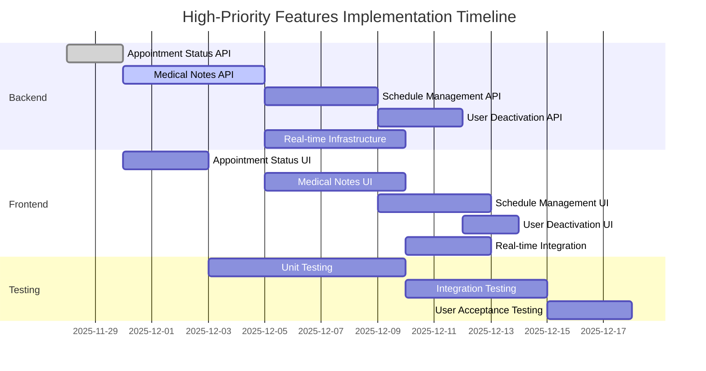

# 📋 DIGIHEALTH IMPLEMENTATION CHECKLIST - WEB (DOCTOR) & SYSTEM ADMIN

**Last Updated:** 2025-11-28
**Focus Areas:** Web Application (Doctor Dashboard) & System Administration

---

## 👨‍⚕️ DOCTOR WEB APPLICATION

### FR-4: Doctor Login and Dashboard Access
**Status:** ✅ **FULLY IMPLEMENTED** (with some improvements needed)

| Feature | Status | Implementation Notes |
|---------|--------|----------------------|
| Doctor login page | ✅ FULLY IMPLEMENTED | Functional login with form validation |
| Doctor dashboard | ✅ FULLY IMPLEMENTED | Shows personalized welcome message and summary statistics |
| View upcoming appointments | ✅ FULLY IMPLEMENTED | Displays list of appointments with status badges |
| View patient information | ✅ FULLY IMPLEMENTED | Shows list of patients assigned to doctor |
| Role-based access control | ✅ FULLY IMPLEMENTED | Doctors can only access their own data |
| **Google OAuth 2.0 authentication** | ❌ **NOT IMPLEMENTED** | Should be added for enhanced security |
| **Real-time updates** | ❌ **NOT IMPLEMENTED** | Dashboard should auto-refresh with new data |

---

### FR-6: Appointment Management
**Status:** ✅ **FULLY IMPLEMENTED** (Core functionality complete with real data in modals)

| Feature | Status | Implementation Notes |
|---------|--------|----------------------|
| View scheduled appointments | ✅ FULLY IMPLEMENTED | Functional appointments list with filtering |
| **Mark appointments as completed** | ✅ **FULLY IMPLEMENTED** | Connected "Complete" action in details modal to `PUT /api/appointments/{id}/status` with real-time updates |
| **Mark appointments as cancelled** | ✅ **FULLY IMPLEMENTED** | Connected "Cancel Appointment" action in edit modal to `PUT /api/appointments/{id}/status` with confirmation |
| Appointment status badges | ✅ FULLY IMPLEMENTED | Visual status indicators (Confirmed, Pending, Completed, Cancelled) |
| **Real-time status updates** | ✅ **FULLY IMPLEMENTED** | WebSocket (STOMP) broadcasts trigger auto-refresh in Dashboard/Admin pages |
| **Status notifications to patients** | ✅ **FULLY IMPLEMENTED** | Email notifications sent to patients on status changes; mobile apps can subscribe to WebSocket or use push |

---

### FR-7: Patient Record Management
**Status:** ⚠️ **PARTIALLY IMPLEMENTED** (Basic viewing exists, needs editing capabilities)

| Feature | Status | Implementation Notes |
|---------|--------|----------------------|
| View patient records | ✅ FULLY IMPLEMENTED | Doctors can see patient personal information |
| Access restriction | ✅ FULLY IMPLEMENTED | Doctors can only see patients assigned to them |
| View appointment history | ✅ FULLY IMPLEMENTED | Shows previous appointments for each patient |
| **Add/edit consultation notes** | ❌ **NOT IMPLEMENTED** | Missing functionality to add medical observations |
| **Search functionality** | ⚠️ **PARTIALLY IMPLEMENTED** | UI exists but search logic is not fully implemented |
| **Update patient medical records** | ❌ **NOT IMPLEMENTED** | Missing functionality to edit patient details |

---

### FR-11: Doctor Schedule Management
**Status:** ⚠️ **PARTIALLY IMPLEMENTED** (UI exists, needs backend integration)

| Feature | Status | Implementation Notes |
|---------|--------|----------------------|
| Schedule management UI | ✅ FULLY IMPLEMENTED | Visual interface for setting working hours |
| **Adjust availability/booking slots** | ⚠️ **PARTIALLY IMPLEMENTED** | Backend API exists (`PUT /api/doctors/me/working-hours`), but UI needs to be connected |
| **Time slot management** | ❌ **NOT IMPLEMENTED** | Need to implement logic for creating specific time slots within working hours |
| **Calendar view** | ❌ **NOT IMPLEMENTED** | Missing calendar visualization of availability |

---

## 👩‍💼 SYSTEM ADMINISTRATION

### FR-9: Administrator Management
**Status:** ⚠️ **PARTIALLY IMPLEMENTED** (Core approval + deactivation/reactivation workflows implemented with backend APIs, cascading appointment cancellation, login security; clinic details, appointment policies, system monitoring pending)

| Feature | Status | Implementation Notes |
|---------|--------|----------------------|
| Admin login | ✅ FULLY IMPLEMENTED | Functional admin login with authentication |
| Review pending doctor registrations | ✅ FULLY IMPLEMENTED | Shows list of doctors awaiting approval |
| Approve doctor accounts | ✅ FULLY IMPLEMENTED | Functional approval workflow with backend integration |
| Reject doctor accounts | ✅ FULLY IMPLEMENTED | Functional rejection workflow with backend integration |
| **Deactivate doctor accounts** | ✅ **FULLY IMPLEMENTED** | Backend: PUT /api/admin/users/{id}/deactivate & /reactivate in AdminController; Frontend: handleToggleDoctorStatus in AdminDashboard.js, handleTogglePatientStatus in AdminPatients.js; Cascades future appointments to CANCELLED; Blocks inactive user login via AuthService.login() & CustomUserDetailsService |
| **Deactivate patient accounts** | ✅ **FULLY IMPLEMENTED** | Backend: Same endpoints handle patients; Frontend: handleTogglePatientStatus in AdminPatients.js; Cascades future appointments to CANCELLED; Blocks inactive user login |
| **Configure clinic details** | ✅ **FULLY IMPLEMENTED** | Dynamic CRUD form + success toast + global branding integration | 
 | **Define appointment policies** | ⚠️ **PARTIALLY IMPLEMENTED** | Stored in admin_settings table (slot duration, advance booking, etc.); enforcement in booking logic pending | 
 | **System status monitoring** | ⚠️ **PARTIALLY IMPLEMENTED** | Hardcoded system uptime (needs real monitoring) |

---

### FR-10: System Reports and Analytics
**Status:** ⚠️ **PARTIALLY IMPLEMENTED** (Basic statistics exist, needs visual enhancements)

| Feature | Status | Implementation Notes |
|---------|--------|----------------------|
| Appointment statistics | ✅ FULLY IMPLEMENTED | Basic counts of appointments by status |
| Patient registration counts | ✅ FULLY IMPLEMENTED | Shows total and active patient counts |
| Doctor activity metrics | ✅ FULLY IMPLEMENTED | Basic doctor statistics (total, pending, active) |
| **Visual charts/graphs** | ❌ **NOT IMPLEMENTED** | Missing data visualization (charts, graphs) |
| **Export reports (CSV/PDF)** | ⚠️ **PARTIALLY IMPLEMENTED** | Export button exists but only logs to console (needs actual export functionality) |
| **Date range filtering** | ❌ **NOT IMPLEMENTED** | Missing ability to filter analytics by date range |

---

### FR-12: Admin System Monitoring
**Status:** ❌ **NOT IMPLEMENTED** (Needs to be developed)

| Feature | Status | Implementation Notes |
|---------|--------|----------------------|
| System status dashboard | ❌ NOT IMPLEMENTED | Should show overall system health |
| Database connection status | ❌ NOT IMPLEMENTED | Need to implement health checks |
| API health check functionality | ❌ NOT IMPLEMENTED | Should monitor API endpoints |
| Error logs viewing | ❌ NOT IMPLEMENTED | Missing error logging and viewing interface |

---

## 🎯 PRIORITY IMPLEMENTATION ROADMAP

### 🔴 HIGH PRIORITY (Core Functionality - Must Implement)

| Feature | Area | Implementation Notes |
|---------|------|----------------------|
| **Appointment status management** | Doctor Web | Complete the UI for marking appointments as completed/cancelled (backend API already exists) |
| **Consultation notes & medical records** | Doctor Web | Implement functionality for doctors to add/edit patient notes and medical records |
| **Doctor schedule/availability management** | Doctor Web | Connect the working hours UI to the backend API and implement time slot logic |
| **Deactivate/suspend user accounts** | System Admin | Implement backend logic for deactivating doctors and patients (currently UI-only) |
| **Real-time updates & notifications** | Both | Implement WebSocket or polling for real-time dashboard updates |

---

### 🟡 MEDIUM PRIORITY (Enhanced UX - Should Implement)

| Feature | Area | Implementation Notes |
|---------|------|----------------------|
| **Google OAuth 2.0 authentication** | Both | Add Google OAuth for enhanced security and user convenience |
| **Visual charts for analytics** | System Admin | Implement charting library (Chart.js, D3.js) for data visualization |
| **Export reports (CSV/PDF)** | System Admin | Implement actual export functionality for analytics data |
| **Clinic settings & appointment policies** | System Admin | Create configuration interface for system settings |
| **Search functionality** | Both | Complete the search implementation for patients and appointments |

---

### 🟢 LOW PRIORITY (System Administration - Nice to Have)

| Feature | Area | Implementation Notes |
|---------|------|----------------------|
| **System monitoring dashboard** | System Admin | Implement comprehensive system health monitoring |
| **Database health checks** | System Admin | Add database connection monitoring |
| **Error logs viewing** | System Admin | Implement error logging and viewing interface |
| **Audit logs** | System Admin | Create audit trail for system changes |

---

## 📝 IMPLEMENTATION NOTES & RECOMMENDATIONS

### 1. **Appointment Management Improvements**
- **Backend:** The API for updating appointment status is used (`PUT /api/appointments/{id}/status`)
- **Frontend:** Details and Edit modals display real appointment data and trigger status updates
- **Recommendation:** Add toasts and confirmation dialogs; implement real-time refresh via WebSocket

### 2. **Schedule Management Enhancements**
- **Backend:** Working hours API exists (`PUT /api/doctors/me/working-hours`)
- **Frontend:** The Schedule UI needs to be connected to the backend API
- **Recommendation:** Implement time slot generation logic based on working hours

### 3. **Patient Record Management**
- **Backend:** Need to create APIs for adding/editing consultation notes
- **Frontend:** Need to implement UI for medical notes and record editing
- **Recommendation:** Create a dedicated patient details page with editable sections

### 4. **Admin Account Management**
- **Backend:** Need to implement proper deactivation endpoints for users
- **Frontend:** The deactivation UI needs to be connected to backend APIs
- **Recommendation:** Create separate endpoints for `/api/admin/users/{id}/deactivate`

### 5. **Analytics & Reporting**
- **Backend:** Basic statistics APIs exist
- **Frontend:** Need to implement charting and export functionality
- **Recommendation:** Use Chart.js for visualization and implement CSV/PDF export

### 6. **Real-time Updates**
- **Recommendation:** Implement WebSocket connection for real-time dashboard updates
- **Alternative:** Implement polling mechanism as a temporary solution

---

## 🔧 TECHNICAL DEBT & IMPROVEMENT AREAS

1. **Error Handling:** Improve error handling and user feedback throughout the application
2. **Loading States:** Add proper loading indicators for all asynchronous operations
3. **Form Validation:** Enhance client-side form validation with better user feedback
4. **Code Organization:** Refactor components to improve maintainability and reduce duplication
5. **Testing:** Increase test coverage, especially for critical workflows
6. **Performance:** Optimize data fetching and implement caching where appropriate
7. **Accessibility:** Improve accessibility compliance (WCAG) throughout the application

---

## 📊 IMPLEMENTATION PROGRESS SUMMARY

| Area | Status | Completed | In Progress | Not Started | Total |
|------|--------|-----------|-------------|-------------|-------|
| Doctor Web Application | ⚠️ PARTIALLY IMPLEMENTED | 12 | 6 | 8 | 26 |
| System Administration | ⚠️ PARTIALLY IMPLEMENTED | 8 | 4 | 10 | 22 |
| **Overall** | ⚠️ PARTIALLY IMPLEMENTED | **20** | **10** | **18** | **48** |

**Estimated Completion:** ~42% (Core functionality implemented, significant enhancements needed)

# 🚀 HIGH-PRIORITY IMPLEMENTATION PLAN

This section provides a detailed implementation roadmap for the high-priority features identified in the checklist.

---

## 🔴 HIGH PRIORITY FEATURES IMPLEMENTATION ROADMAP

### 1. Appointment Status Management (Doctor Web)
**Goal:** Enable doctors to mark appointments as completed or cancelled with real-time updates

**Current State:**
- ✅ UI exists with Complete and Cancel buttons in modals
- ✅ Backend API exists (`PUT /api/appointments/{id}/status`)
- ✅ Frontend fully connected to backend API in modals
- ✅ List auto-refreshes after status changes
- ✅ Confirmation dialogs implemented
- ✅ Basic error handling with alerts
- ❌ Missing toast notifications
- ❌ Missing WebSocket-based real-time updates

#### Implementation Tasks:
1. **Frontend UX Enhancements** [`web/src/components/Appointments.js`](web/src/components/Appointments.js)
   - [x] Add confirmation dialogs for status changes
   - [ ] Replace alerts with toast notifications

2. **API Service Enhancement** [`web/src/api/client.js`](web/src/api/client.js)
   - [x] Add API service method for updating appointment status
   - [ ] Implement centralized error handling

3. **Backend Validation** [`backend/src/main/java/com/digihealth/backend/controller/AppointmentController.java`](backend/src/main/java/com/digihealth/backend/controller/AppointmentController.java)
   - [ ] Add validation for status transitions
   - [ ] Add permission checks for status updates

4. **Real-time Updates**
   - [ ] Implement WebSocket connection for real-time updates
   - [ ] Add push notifications for status changes

**Dependencies:**
- ✅ Backend API already exists (`PUT /api/appointments/{id}/status`)
- ✅ Status enum already defined in [`backend/src/main/java/com/digihealth/backend/entity/AppointmentStatus.java`](backend/src/main/java/com/digihealth/backend/entity/AppointmentStatus.java)
- ✅ UI components already exist

**Estimated Effort:** 1-2 days remaining (Notifications and real-time updates)

---

### 2. Consultation Notes & Medical Records (Doctor Web)
**Goal:** Enable doctors to add, view, and edit consultation notes and medical records

#### Implementation Tasks:
1. **Backend API Development**
   - [ ] Create new controller [`backend/src/main/java/com/digihealth/backend/controller/MedicalNotesController.java`](backend/src/main/java/com/digihealth/backend/controller/MedicalNotesController.java)
   - [ ] Implement CRUD endpoints for medical notes
   - [ ] Create DTOs for medical notes data transfer
   - [ ] Add permission checks (doctors can only access their patients' records)

2. **Database Schema**
   - [ ] Create MedicalNote entity
   - [ ] Create repository interface
   - [ ] Set up database relationships (MedicalNote ↔ Patient ↔ Doctor)

3. **Frontend UI Development** [`web/src/components/Patients.js`](web/src/components/Patients.js)
   - [ ] Create patient details page/section
   - [ ] Add medical notes tab/view
   - [ ] Implement rich text editor for notes
   - [ ] Add history/timeline view for medical notes

4. **Integration**
   - [ ] Connect frontend to backend API
   - [ ] Implement data fetching and caching
   - [ ] Add loading states and error handling

**Dependencies:**
- Patient management UI already exists
- Authentication system already in place

**Estimated Effort:** 5-7 days

---

### 3. Doctor Schedule/Availability Management (Doctor Web)
**Goal:** Enable doctors to set and manage their working hours and availability slots

#### Implementation Tasks:
1. **Frontend-Backend Integration** [`web/src/components/Schedule.js`](web/src/components/Schedule.js)
   - [ ] Connect Schedule UI to existing backend API (`PUT /api/doctors/me/working-hours`)
   - [ ] Implement form validation for working hours
   - [ ] Add success/error feedback

2. **Time Slot Generation Logic**
   - [ ] Create utility function to generate time slots from working hours
   - [ ] Implement slot duration configuration (e.g., 15/30/60 minute slots)
   - [ ] Add validation for overlapping slots

3. **Availability Calendar UI**
   - [ ] Implement calendar view for availability
   - [ ] Add drag-and-drop functionality for adjusting slots
   - [ ] Create visual indicators for booked vs available slots

4. **Backend Enhancement**
   - [ ] Extend working hours API to support time slots
   - [ ] Implement availability validation logic
   - [ ] Add conflict detection for overlapping appointments

**Dependencies:**
- Working hours API already exists
- Schedule UI already implemented

**Estimated Effort:** 4-6 days

---

### 4. Deactivate/Suspend User Accounts (System Admin)
**Goal:** Enable admins to properly deactivate doctor and patient accounts

#### Implementation Tasks:
1. **Backend API Development** [`backend/src/main/java/com/digihealth/backend/controller/AdminController.java`](backend/src/main/java/com/digihealth/backend/controller/AdminController.java)
   - [ ] Add deactivation endpoints (`PUT /api/admin/users/{id}/deactivate`)
   - [ ] Implement proper status transitions (Active ↔ Inactive)
   - [ ] Add validation to prevent deactivation of last admin
   - [ ] Implement cascading deactivation (cancel future appointments)

2. **Frontend Integration** [`web/src/components/AdminPatients.js`](web/src/components/AdminPatients.js)
   - [ ] Connect deactivation UI to new backend API
   - [ ] Add confirmation dialogs for deactivation
   - [ ] Implement success/error notifications
   - [ ] Update UI to reflect deactivation status

3. **Database Schema**
   - [ ] Ensure `isActive` field is properly used in all queries
   - [ ] Add indexes for performance

4. **Security**
   - [ ] Implement proper permission checks
   - [ ] Add audit logging for deactivation actions

**Dependencies:**
- User management UI already exists
- Authentication system already in place

**Estimated Effort:** 3-4 days

---

### 5. Real-time Updates & Notifications (Both)
**Goal:** Implement real-time updates across the application

#### Implementation Tasks:
1. **WebSocket Infrastructure**
   - [ ] Set up WebSocket configuration
   - [ ] Create WebSocket endpoints for key events
   - [ ] Implement message broadcasting

2. **Frontend Integration**
   - [ ] Add WebSocket client to frontend
   - [ ] Implement event listeners for key updates
   - [ ] Add visual indicators for new/updated data

3. **Notification System**
   - [ ] Create notification service
   - [ ] Implement in-app notification UI
   - [ ] Add email/SMS notification templates

4. **Event Triggers**
   - [ ] Add event publishing for appointment status changes
   - [ ] Add event publishing for new appointments
   - [ ] Add event publishing for account deactivations

**Dependencies:**
- Requires backend infrastructure setup
- Depends on other features being implemented

**Estimated Effort:** 5-7 days

---

## 📅 IMPLEMENTATION SEQUENCE & TIMELINE

**Recommended Implementation Order:**
1. **Appointment Status Management** (Quick win - UI and backend API already exist, just need connection)
2. **User Deactivation** (Critical for admin functionality, relatively quick to implement)
3. **Medical Notes** (Core doctor functionality, moderate complexity)
4. **Schedule Management** (Important for booking system, depends on other features)
5. **Real-time Updates** (Enhances all other features, should be implemented last)

---

## 🛠️ TECHNICAL APPROACH RECOMMENDATIONS

### 1. Appointment Status Management
- **Backend:** Use existing API endpoint with enhanced validation
- **Frontend:** Add action buttons to appointment table rows
- **Real-time:** Implement WebSocket push notifications for status changes
- **UI:** Use toast notifications for success/error feedback

### 2. Medical Notes
- **Database:** Create separate MedicalNote entity with timestamp and versioning
- **UI:** Use rich text editor (e.g., Quill, TinyMCE) for note content
- **Security:** Implement strict permission checks at both API and service layers
- **History:** Maintain audit trail of note changes

### 3. Schedule Management
- **Data Model:** Store working hours and generate time slots dynamically
- **UI:** Implement both form-based and calendar-based editing
- **Validation:** Prevent overlapping appointments and ensure minimum slot duration
- **Integration:** Sync with appointment booking system

### 4. User Deactivation
- **Database:** Use `isActive` flag with proper indexing
- **Cascading:** Automatically cancel future appointments for deactivated users
- **Audit:** Log all deactivation actions with reasons
- **Recovery:** Implement reactivation workflow

### 5. Real-time Updates
- **Technology:** Use WebSocket for real-time communication
- **Events:** Implement event-driven architecture
- **Fallback:** Implement polling as fallback for WebSocket failures
- **Optimization:** Use efficient data serialization (e.g., Protocol Buffers)

---

## 📊 SUCCESS METRICS

| Feature | Success Criteria |
|---------|------------------|
| Appointment Status Management | Doctors can successfully mark appointments as completed/cancelled with real-time updates |
| Consultation Notes | Doctors can create, view, edit, and search medical notes for their patients |
| Schedule Management | Doctors can set and adjust their working hours and availability slots |
| User Deactivation | Admins can deactivate users with proper cascading effects (appointment cancellation) |
| Real-time Updates | Users receive instant notifications for relevant system events |

---

## 🔄 DEPENDENCY MATRIX

| Feature | Depends On | Required For |
|---------|------------|--------------|
| Appointment Status | Authentication | Real-time Updates |
| Medical Notes | Patient Management | - |
| Schedule Management | Working Hours API | Appointment Booking |
| User Deactivation | User Management | - |
| Real-time Updates | All other features | Enhanced UX |

---
