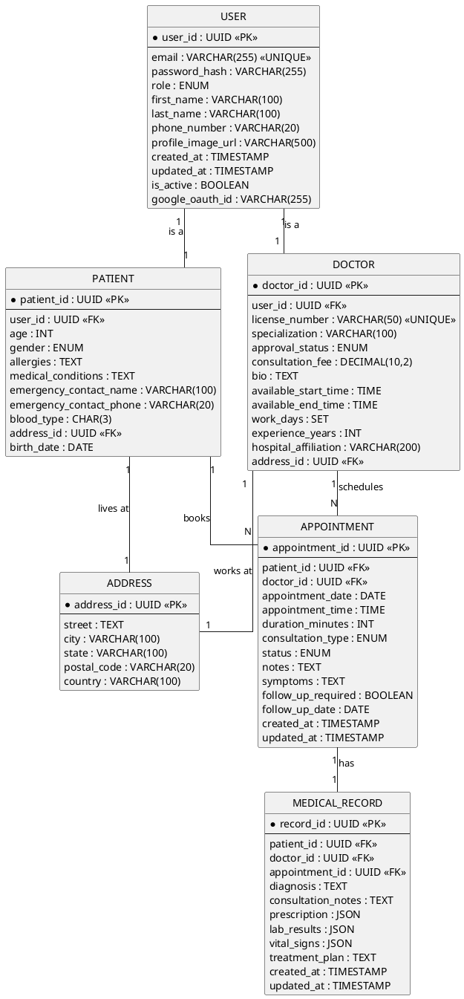

Here is the ERD translated into PlantUML syntax:

```plantuml
@startuml
' hide the spot
hide circle

' avoid problems with angled crows feet
skinparam linetype ortho

entity "USER" {
  * user_id : UUID <<PK>>
  --
  email : VARCHAR(255) <<UNIQUE>>
  password_hash : VARCHAR(255)
  role : ENUM
  first_name : VARCHAR(100)
  last_name : VARCHAR(100)
  phone_number : VARCHAR(20)
  profile_image_url : VARCHAR(500)
  created_at : TIMESTAMP
  updated_at : TIMESTAMP
  is_active : BOOLEAN
  google_oauth_id : VARCHAR(255)
}

entity "PATIENT" {
  * patient_id : UUID <<PK>>
  --
  user_id : UUID <<FK>>
  age : INT
  gender : ENUM
  allergies : TEXT
  medical_conditions : TEXT
  emergency_contact_name : VARCHAR(100)
  emergency_contact_phone : VARCHAR(20)
  blood_type : CHAR(3)
  address_id : UUID <<FK>>
  birth_date : DATE
}

entity "DOCTOR" {
  * doctor_id : UUID <<PK>>
  --
  user_id : UUID <<FK>>
  license_number : VARCHAR(50) <<UNIQUE>>
  specialization : VARCHAR(100)
  approval_status : ENUM
  consultation_fee : DECIMAL(10,2)
  bio : TEXT
  available_start_time : TIME
  available_end_time : TIME
  work_days : SET
  experience_years : INT
  hospital_affiliation : VARCHAR(200)
  address_id : UUID <<FK>>
}

entity "ADDRESS" {
  * address_id : UUID <<PK>>
  --
  street : TEXT
  city : VARCHAR(100)
  state : VARCHAR(100)
  postal_code : VARCHAR(20)
  country : VARCHAR(100)
}

entity "APPOINTMENT" {
  * appointment_id : UUID <<PK>>
  --
  patient_id : UUID <<FK>>
  doctor_id : UUID <<FK>>
  appointment_date : DATE
  appointment_time : TIME
  duration_minutes : INT
  consultation_type : ENUM
  status : ENUM
  notes : TEXT
  symptoms : TEXT
  follow_up_required : BOOLEAN
  follow_up_date : DATE
  created_at : TIMESTAMP
  updated_at : TIMESTAMP
}

entity "MEDICAL_RECORD" {
  * record_id : UUID <<PK>>
  --
  patient_id : UUID <<FK>>
  doctor_id : UUID <<FK>>
  appointment_id : UUID <<FK>>
  diagnosis : TEXT
  consultation_notes : TEXT
  prescription : JSON
  lab_results : JSON
  vital_signs : JSON
  treatment_plan : TEXT
  created_at : TIMESTAMP
  updated_at : TIMESTAMP
}

' Relationships
USER "1" -- "1" PATIENT : "is a"
USER "1" -- "1" DOCTOR : "is a"
PATIENT "1" -- "N" APPOINTMENT : "books"
DOCTOR "1" -- "N" APPOINTMENT : "schedules"
APPOINTMENT "1" -- "1" MEDICAL_RECORD : "has"
PATIENT "1" -- "1" ADDRESS : "lives at"
DOCTOR "1" -- "1" ADDRESS : "works at"

@enduml
```
